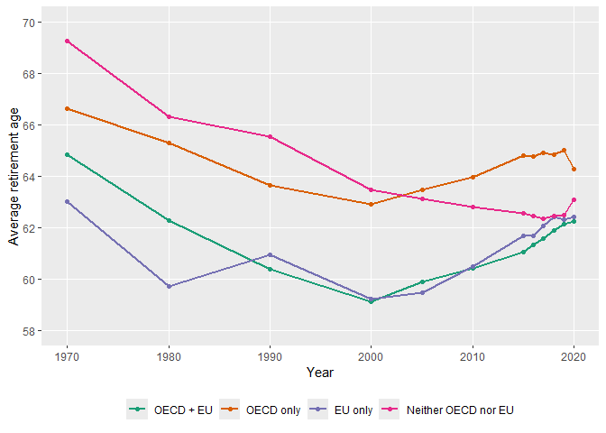
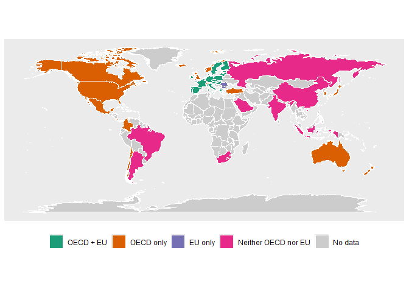
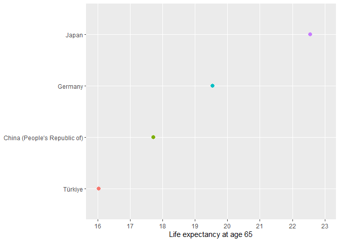
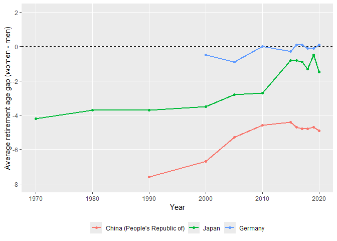
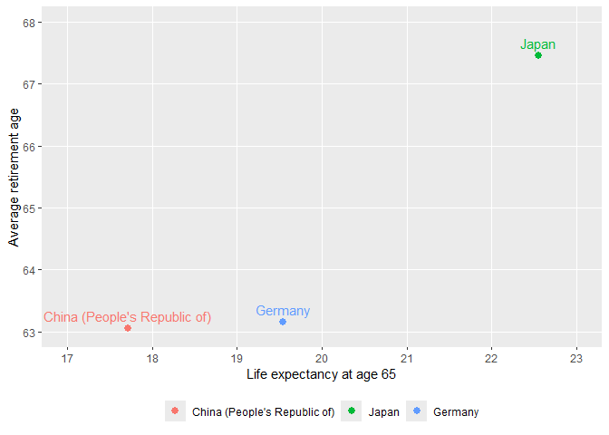

<!-- README.md is generated from README.Rmd. Please edit that file -->

# retirer

<!-- badges: start -->

<!-- badges: end -->

The goal of `retirer` is to make it easy to explore retirement-age and
demographic patterns in a single, reproducible workflow.

`retirer` provides tools for working with a cleaned package data set
built from two public sources:

- OECD effective labour market exit age data by country, sex, and year
- United Nations World Population Prospects demographic indicators

The package is designed for users who want to move quickly from a
research question to a defensible visualization or a tidy analytical
data set.

It is especially useful for questions such as:

- How do retirement-age trends differ across OECD and EU membership
  groups?
- How do countries compare in a single year?
- How do women and men differ on retirement age, life expectancy, and
  mortality-related measures?
- How are retirement patterns related to demographic indicators such as
  life expectancy, fertility, migration, mortality, and population size?

## Installation

You can install the development version of `retirer` from GitHub with:

``` r
# install.packages("pak")
pak::pak("coopernelson112/retirer")
```

## Data sources

The package data included in `retirer` are a cleaned and joined version
of:

- an OECD data source on effective labour market exit age by country,
  sex, and year
- the United Nations World Population Prospects 2024 demographic
  indicators file

The raw source files used during development live in `data-raw/`
locally, and the package includes a reproducible cleaning script,
`data-raw/build_retirement.R`, that constructs the final package data
set.

The package vignette shows how to work with the cleaned package data,
while the `data-raw/` script documents how the package data were built.

## What the package includes

`retirer` currently supports five main kinds of analysis:

- **Trend plots** for retirement and demographic measures over time
- **Map-based group comparisons** for OECD and EU membership structure
- **Snapshot plots** for one-year cross-sectional comparisons
- **Sex-comparison plots** for women-versus-men and sex-gap analysis
- **Relationship plots** for studying how two measures move together

It also includes helper functions that return the underlying tidy data
used in the plots.

## Quick start

Load the package:

``` r
library(retirer)
```

Inspect the built-in data:

``` r
head(retirement)
#>     country year ave_age_men ave_age_women oecd_country SortOrder LocID Notes
#> 1 Argentina 1990        63.9          64.6           no       279    32  <NA>
#> 2 Argentina 2000        67.0          68.9           no       279    32  <NA>
#> 3 Argentina 2005        65.7          63.7           no       279    32  <NA>
#> 4 Argentina 2010        66.0          63.0           no       279    32  <NA>
#> 5 Argentina 2015        65.2          62.5           no       279    32  <NA>
#> 6 Argentina 2016        65.1          62.1           no       279    32  <NA>
#>   ISO3_code ISO2_code SDMX_code LocTypeID  LocTypeName ParentID  Location VarID
#> 1       ARG        AR        32         4 Country/Area      931 Argentina     2
#> 2       ARG        AR        32         4 Country/Area      931 Argentina     2
#> 3       ARG        AR        32         4 Country/Area      931 Argentina     2
#> 4       ARG        AR        32         4 Country/Area      931 Argentina     2
#> 5       ARG        AR        32         4 Country/Area      931 Argentina     2
#> 6       ARG        AR        32         4 Country/Area      931 Argentina     2
#>   Variant Time TPopulation1Jan TPopulation1July TPopulationMale1July
#> 1  Medium 1990        32514.72         32755.90             16124.94
#> 2  Medium 2000        37006.58         37213.98             18343.80
#> 3  Medium 2005        39013.70         39216.79             19341.99
#> 4  Medium 2010        41070.54         41288.69             20404.98
#> 5  Medium 2015        43252.20         43477.01             21537.70
#> 6  Medium 2016        43701.82         43900.31             21752.90
#>   TPopulationFemale1July PopDensity PopSexRatio MedianAgePop NatChange
#> 1               16630.96    11.7329     96.9573      26.2919   466.655
#> 2               18870.19    13.3297     97.2105      26.8366   437.582
#> 3               19874.80    14.0471     97.3192      27.7538   428.235
#> 4               20883.72    14.7892     97.7076      28.8739   441.305
#> 5               21939.31    15.5731     98.1695      29.8606   444.146
#> 6               22147.41    15.7247     98.2187      30.0510   391.767
#>   NatChangeRT PopChange PopGrowthRate DoublingTime  Births Births1519    CBR
#> 1      14.246   482.370         1.473      47.0568 723.193     98.370 22.078
#> 2      11.758   414.810         1.115      62.1657 719.276    106.574 19.328
#> 3      10.920   406.173         1.036      66.9061 717.902    104.846 18.306
#> 4      10.689   436.311         1.057      65.5768 756.144    114.039 18.314
#> 5      10.216   449.618         1.034      67.0355 768.023    109.297 17.665
#> 6       8.924   396.985         0.904      76.6756 737.028    100.296 16.789
#>      TFR    NRR    MAC   SRB  Deaths DeathsMale DeathsFemale   CDR     LEx
#> 1 3.0342 1.4199 27.650 105.4 256.538    139.323      117.215 7.832 71.6145
#> 2 2.5906 1.2236 27.827 105.5 281.694    150.118      131.576 7.570 73.9100
#> 3 2.4259 1.1487 27.945 105.9 289.667    153.513      136.154 7.386 75.2306
#> 4 2.4109 1.1422 27.896 106.1 314.839    161.596      153.243 7.625 75.6800
#> 5 2.3496 1.1187 27.985 105.7 323.877    169.545      154.332 7.449 76.5995
#> 6 2.2407 1.0673 27.993 105.6 345.261    178.664      166.597 7.865 76.1050
#>   LExMale LExFemale    LE15 LE15Male LE15Female    LE65 LE65Male LE65Female
#> 1 68.3475   74.8781 59.0179  55.8533    62.1477 15.1885  13.1850    16.8479
#> 2 70.4976   77.2885 60.7088  57.3712    63.9870 16.5296  14.3640    18.3144
#> 3 71.7671   78.6321 61.7722  58.3797    65.0788 17.1367  14.7934    19.0790
#> 4 72.5419   78.7322 62.0041  58.9145    64.9908 17.3404  15.2176    19.0933
#> 5 73.3670   79.7949 62.7390  59.5528    65.8730 17.8744  15.6655    19.7565
#> 6 73.0445   79.1308 62.2109  59.1884    65.1860 17.4514  15.3380    19.2620
#>     LE80 LE80Male LE80Female InfantDeaths     IMR LBsurvivingAge1 Under5Deaths
#> 1 6.4408   5.5557     6.9536       18.495 25.6221         706.772       21.367
#> 2 7.6299   6.6246     8.2001       13.382 18.5965         707.392       15.418
#> 3 8.0515   6.7999     8.7623       11.170 15.5812         708.033       12.781
#> 4 8.1200   6.9564     8.7755        9.987 13.2336         747.364       11.397
#> 5 8.4856   7.2652     9.2210        8.685 11.2954         760.446        9.888
#> 6 8.2420   7.0485     8.9705        8.120 10.9588         729.979        9.310
#>        Q5   Q0040 Q0040Male Q0040Female    Q0060 Q0060Male Q0060Female   Q1550
#> 1 29.7242 62.8106   72.3788     52.9598 181.7842  226.4618    136.6136 67.8092
#> 2 21.4278 53.3112   65.1919     41.0013 157.4304  197.8421    116.4085 62.0308
#> 3 17.8537 45.7490   56.2688     34.8109 140.8921  177.1817    104.0316 54.4757
#> 4 15.1620 44.3647   54.6366     33.6283 135.9233  167.6677    103.5371 54.4422
#> 5 12.8914 40.7740   51.3910     29.6312 125.7332  156.6954     93.9010 51.1637
#> 6 12.5275 41.2893   51.1970     30.9001 129.4225  159.7543     98.2569 53.0629
#>   Q1550Male Q1550Female    Q1560 Q1560Male Q1560Female NetMigrations   CNMR
#> 1   84.4197     51.0873 153.7611  197.4676    109.9454        15.719  0.480
#> 2   79.8124     43.8662 136.4739  176.0215     96.5923       -22.775 -0.612
#> 3   69.8168     38.7595 122.8743  158.2172     87.1983       -22.068 -0.563
#> 4   68.8354     39.6041 120.4260  151.5085     88.8609        -5.003 -0.121
#> 5   65.9430     35.8617 112.4054  142.6926     81.3872         5.464  0.126
#> 6   67.6137     38.0079 116.4460  146.2386     85.9373         5.215  0.119
head(sex_comparable_measures())
#> [1] "retirement_age"   "TPopulation1July" "Deaths"           "LEx"             
#> [5] "LE15"             "LE65"
head(retirement_countries())
#> [1] "Argentina" "Australia" "Austria"   "Belgium"   "Brazil"    "Bulgaria"
```

Plot retirement-age trends across OECD and EU membership groups:

``` r
plot_retirement_trends()
```



Map OECD and EU membership groups:

``` r
map_groups(year = 2020)
```



Compare countries in a single year:

``` r
plot_measure_snapshot(
  measure = "LE65",
  year = 2020,
  level = "country",
  countries = c("China", "Japan", "Germany", "Turkey")
)
```



Study women-men differences:

``` r
plot_sex_gap_trends(
  measure = "retirement_age",
  level = "country",
  countries = c("China", "Japan", "Germany")
)
```



Study the relationship between retirement age and life expectancy:

``` r
plot_measure_relationship(
  x_measure = "LE65",
  y_measure = "retirement_age",
  year = 2020,
  level = "country",
  countries = c("China", "Japan", "Germany"),
  show_labels = TRUE,
  add_smooth = FALSE
)
```



## Main function families

### Discovery and helper functions

Use these to inspect the structure of the data and the available
measures.

- `retirement_countries()`
- `retirement_country_aliases()`
- `retirement_groups()`
- `retirement_variables()`
- `retirement_year_measures()`
- `sex_comparable_measures()`

### Trend plots

Use these when your main question is about change over time.

- `plot_retirement_trends()`
- `plot_demography_trends()`
- `plot_retirement_vs_demography()`

### Map-based comparisons

Use these when your main question is geographic rather than temporal.

- `map_groups()`

### Snapshot plots

Use these when your main question is about comparison within a single
year.

- `measure_snapshot_data()`
- `plot_measure_snapshot()`
- `sex_gap_data()`
- `plot_sex_gap_snapshot()`

### Sex comparison

Use these when your main question is about women versus men or a
directed sex gap.

- `plot_sex_comparison_trends()`
- `plot_sex_gap_trends()`
- `plot_retirement_vs_demography_gap()`

### Relationships

Use these when your main question is about whether two measures are
associated.

- `measure_relationship_data()`
- `plot_measure_relationship()`
- `plot_gap_relationship()`

## Country names and aliases

Country names in the underlying data follow the source conventions, so
some names differ from everyday usage. For example, the data use labels
such as `"China (People's Republic of)"`, `"Korea"`, and `"Türkiye"`.

Most country-level functions accept common aliases such as `"Turkey"`,
`"South Korea"`, `"US"`, and `"UK"` and resolve them internally to the
package’s display labels.

## Learn more

The best next step is the getting-started vignette, which walks through
a full graduate-level exploratory workflow with trends, maps, snapshots,
sex comparisons, relationship plots, and data extraction.

After installation, open it with:

``` r
vignette("getting-started", package = "retirer")
```
